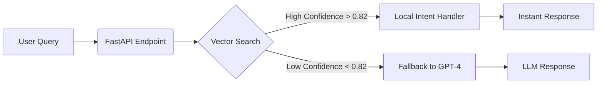

# Semantic Router Microservice 🚀


**A high-performance intent classification layer designed to sit *in front* of Large Language Models (LLMs).**

This microservice intercepts user queries and uses local vector search (Qdrant + FastEmbed) to determine intent. It handles routine requests instantly ($0 cost, <20ms latency) and only routes complex, low-confidence queries to paid LLMs (GPT-4/Claude).

---

## ⚡ The Engineering Problem
LLMs are powerful but **slow** and **expensive**.
* **Cost:** Sending every "Hello" or "Reset Password" query to GPT-4 costs ~$0.01/request.
* **Latency:** Round-trip times for LLMs often exceed 1.5 - 2.0 seconds.

## 🛠 The Solution
We use **Semantic Vector Search** as a caching and routing layer.
1.  **Embed** incoming queries locally using `sentence-transformers/all-MiniLM-L6-v2`.
2.  **Search** a local Qdrant instance for similar "Anchor Intents" (e.g., Pricing, Support, Legal).
3.  **Route** based on cosine similarity thresholds.

**Results:**
| Metric | LLM (GPT-4) | Semantic Router (This Repo) |
| :--- | :--- | :--- |
| **Latency** | ~1,500ms | **~15ms** |
| **Cost** | $0.03 / 1k tokens | **$0.00** |
| **Privacy** | Data leaves infrastructure | **100% Local** |

---

## 🏗 Architecture


## 🚀 Getting Started

### Prerequisites
* Python 3.9+
* Docker (for Qdrant)

### 1. Run Qdrant Vector DB
We use Qdrant as our vector engine. It runs in a lightweight Docker container.
```
docker run -p 6333:6333 -p 6334:6334 \
    -v $(pwd)/qdrant_storage:/qdrant/storage:z \
    qdrant/qdrant
```
### 2. Install Dependencies
```
pip install fastapi uvicorn qdrant-client[fastembed]
```

### 3. Seed the Knowledge Base
Run the ETL script to generate embeddings for our enterprise intents (Sales, Critical Incidents, GDPR).
```
python seed_data.py
```
### 4. Start the Microservice
```
uvicorn main:app --reload
```

API will be live at: http://127.0.0.1:8000

## 🧪 Testing the API

You can use the built-in Swagger UI at http://127.0.0.1:8000/docs or use curl.

**Scenario 1: Critical Incident (High Confidence)**
Input: "The production database is down and throwing 500 errors"

```
curl -X 'POST' \
  '[http://127.0.0.1:8000/route](http://127.0.0.1:8000/route)' \
  -H 'Content-Type: application/json' \
  -d '{ "text": "The production database is down and throwing 500 errors" }'
```

**Response:**
```
{
  "intent": "critical_incident",
  "confidence": 0.89,
  "routing_time_ms": 12.4,
  "action_taken": "Routed to CRITICAL_INCIDENT Handler"
}
```
**Scenario 2: Out of Domain (Low Confidence -> LLM Fallback)**
Input: "Write me a poem about automated testing"
```
curl -X 'POST' \
  '[http://127.0.0.1:8000/route](http://127.0.0.1:8000/route)' \
  -H 'Content-Type: application/json' \
  -d '{ "text": "Write me a poem about automated testing" }'
```
**Response:**
```
{
  "intent": "fallback_llm",
  "confidence": 0.42,
  "routing_time_ms": 11.8,
  "action_taken": "Confidence Low - Routed to GPT-4 for analysis"
}
```
